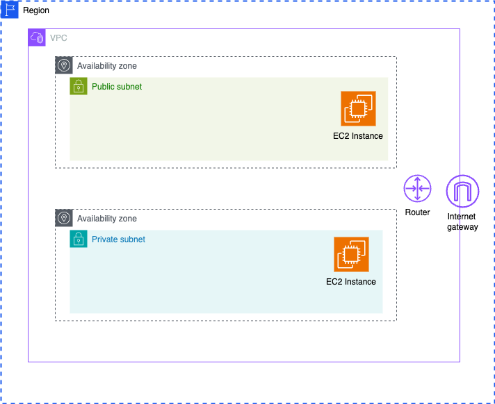

# AWS Project

## Introduction

The goal of this project is to gain proficiency in AWS through multiple projects focused on exploring various resources.

## Project One: Setting Up a VPC with WordPress

### Overview

In this project, we will establish an Amazon Virtual Private Cloud (Amazon VPC), create a subnet within it, and deploy an EC2 instance hosting WordPress into that subnet.

### Amazon VPC Overview

Amazon Virtual Private Cloud (Amazon VPC) is a customizable, isolated section of the AWS cloud where users can launch and manage different AWS resources, such as databases and servers, within a virtual private network.

An AWS VPC is like a virtual house for your cloud resources, such as S3 and EC2. Just as walls in a house separate rooms, a VPC keeps different resources isolated from one another. This means databases and servers can be kept separate. You have full control over each "room" or subnet and its permissions, allowing you to keep servers in one subnet and databases in another.

VPCs are region-specific, meaning each VPC exists within a specific AWS region and cannot span across regions. Within each region, there are multiple availability zones (AZs), which can be utilized to create subnets. Each subnet is confined to a single availability zone, but multiple subnets can exist within one availability zone.

We deploy our EC2 instances into specific subnets within our VPC. Each subnet is associated with a single availability zone and cannot span across availability zones.

The VPC router handles all routing for connections that go outside of a subnet. Route tables define how traffic is routed within the VPC.

To enable internet access for resources within our VPC, we need an Internet Gateway. Each VPC can have one Internet Gateway, which facilitates outgoing (egress) and incoming (ingress) internet traffic.

Every VPC is defined by a CIDR block, which specifies the range of IP addresses available for assignment to its subnets.

### Steps

1. **Create a VPC:**
   - Set up subnets within the VPC for different types of resources.

2. **Set Up a Subnet:**
   - Ensure the subnet is properly configured to maintain isolation and security.

3. **Deploy an EC2 Instance:**
   - Launch an EC2 instance and configure it to host WordPress.
   - Place the EC2 instance within the previously created subnet for isolation and security measures.

### Conclusion

By completing this project, you will have hands-on experience in setting up and managing AWS resources within a VPC, enhancing your skills in cloud infrastructure management.

## Next Steps

Continue exploring AWS by delving into additional projects that explore different AWS services and configurations.

