# Project One: Setting Up a VPC with WordPress 👩🏾‍💻


# 📖 Table of Contents 📖
- [Overview](#overview)
- [Amazon VPC Overview](#amazon-vpc-overview)
- [Steps](#steps)
  - [Step 1: Create a VPC](#step-1-create-a-vpc)
  - [Step 2: Deploy an EC2 Instance](#step-2-deploy-an-ec2-instance)
  - [Step 3: Connecting to EC2](#step-3-connecting-to-ec2-locally)
  - [Step 4: Installing NGINX](#step-4-installing-nginx)
  - [Step 5: Installing PHP](#step-5-installing-php)
  - [Step 6: Installing MariaDB](#step-6-installing-mariadb)
  - [Step 7: Create WordPress Database](#step-7-create-wordpress-database)
  - [Step 8: Configuring NGINX for WordPress](#step-8-configuring-nginx-for-wordpress)
  - [Step 9: Create an Nginx Virtual Host Configuration File](#step-9-create-an-nginx-virtual-host-configuration-file)
  - [Step 10: Access WordPress Installation](#step-10-access-wordpress-installation)
- [Conclusion](#conclusion)


## Overview

In this project, we will establish an Amazon Virtual Private Cloud (Amazon VPC), create a subnet within it, and deploy an EC2 instance hosting WordPress into that subnet.


## Amazon VPC Overview

Amazon Virtual Private Cloud (Amazon VPC) is a customizable, isolated section of the AWS cloud where users can launch and manage different AWS resources, such as databases and servers, within a virtual private network.

An AWS VPC is like a virtual house for your cloud resources, such as S3 and EC2. Just as walls in a house separate rooms, a VPC keeps different resources isolated from one another. This means databases and servers can be kept separate. You have full control over each "room" or subnet and its permissions, allowing you to keep servers in one subnet and databases in another.

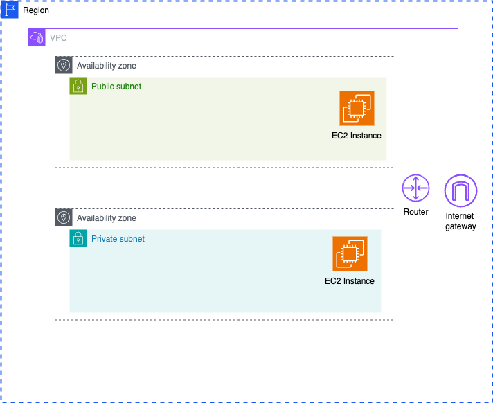

VPCs are region-specific, meaning each VPC exists within a specific AWS region and cannot span across regions. Within each region, there are multiple availability zones (AZs), which can be utilized to create subnets. Each subnet is confined to a single availability zone, but multiple subnets can exist within one availability zone.

We deploy our EC2 instances into specific subnets within our VPC. Each subnet is associated with a single availability zone and cannot span across availability zones.

The VPC router handles all routing for connections that go outside of a subnet. Route tables define how traffic is routed within the VPC.

To enable internet access for resources within our VPC, we need an Internet Gateway. Each VPC can have one Internet Gateway, which facilitates outgoing (egress) and incoming (ingress) internet traffic.

Every VPC is defined by a CIDR block, which specifies the range of IP addresses available for assignment to its subnets.

## Steps

### Step 1: Create a VPC

1. **Create a VPC with public and private subnets**
   - Go into the AWS consol and search for VPC.
   
   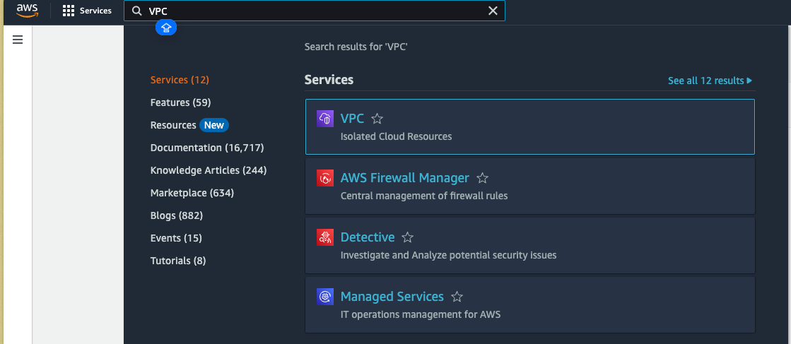
   - On the left side navigation click on `Your VPC's`.
     - By deafult you get an AWS deafult VPC in every region in your AWS account, with a couple subnets for every availabity zone.
    - In the top right click the `Create VPC` button.
    - You should see a options to either to create `VPC only` or `VPC and more`. Click on `VPC and more`.
        - Using the `VPC and more` option, you can create your VPC, subnets, and route tables all at once, without needing to navigate to other sections of the AWS console.
    
    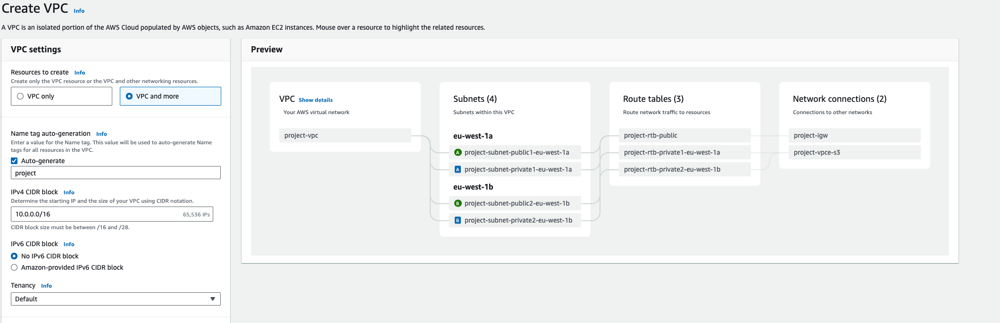

    - Decide on the name of your project I've gone with `my-first-vpc`.


2. **Set Up a Subnets:**
    - Then we need to decide on the CIDR block. This is the network address space that is going to be used for private IP address for this VPC learn more here.
    - By default they give you `10.0.0.0/16`. You can change it to somthing else. I've changed it to `15.0.0.0/16`.

    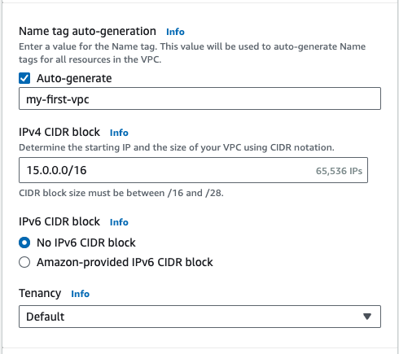

    - Keep everything else in this section the same.
    - In the next section we get to configure the availabilty zones. Leave it as `2`.
    - In the next section we can specificy the number of subnets. Also leave it as `2`.
    - In the next section it allows configuration of NAT gateways. But for this project keep it as `None`.
    - This is our public subnet, which is associated with a route table connected to an internet gateway, providing internet access.
    -  There are two private subnets, each with its own route table for intra-network traffic. They use a VPC endpoint for S3, allowing access without internet usage and keeping traffic within the AWS network.
    -  In summary, we have two public subnets and two private subnets across two availability zones. We use three route tables: one for the public subnets and one for each private subnet. Additionally, we have an internet gateway and a VPC endpoint for S3."

    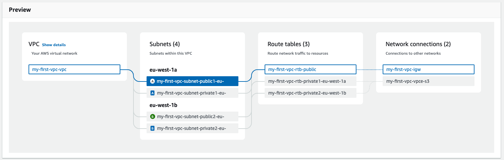

    -  Click on the `Create VPC` button below.


### Step 2: Deploy an EC2 Instance

   - Navigate to the EC2 dashboard.
   - Click on `Launch Instance`.
     
    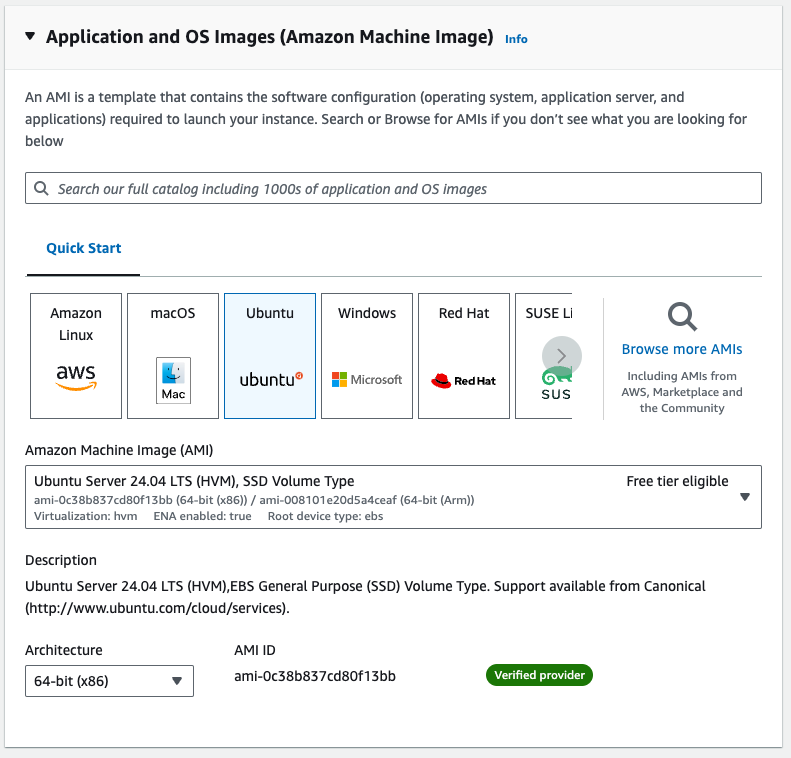

   - Name the instance. For example, `wordpress-server`.
   - Choose the operating system for the virtual computer. In this case, select `Ubuntu`.
   - Keep the instance type as `t2.micro`, which has `1 vCPU` and `1 GiB` of memory.
   - Create a Key Pair to securely connect to your instance via SSH:
        - Click on the `Create new key pair` button.
        - Name the key pair. For example, `wordpress_server`.
        - Keep everything else the same and click on `Create Key Pair`.
        - This will download your private key, keep it secure.

   - Configure the network settings:
        - Ensure `HTTP & HTTPS` traffic is enabled.
        -  Click on `Edit` in the top right corner of this section.
        -   Select the VPC that we created earlier.
        -  Choose the appropriate subnet, in this case, `public1`.
        - Assign a public IP address.
       
    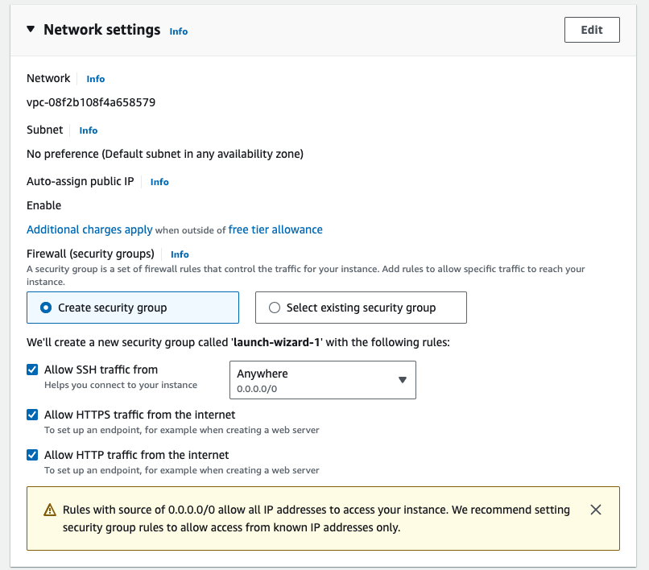

   - Keep the storage setting the same.
   - Click the `Launch Instance` button on the right.

### Step 3: Connecting to EC2 locally

   -  Navigate to your Instances in AWS.
   -  Click on the `Connect` button on the top right.
   -  Navigate to the `SSH client` tab.
   -  Open your terminal.
   -  Navigate to the folder containing your private key.
   -  Set appropriate permissions on your private key:
         -  ```chmod 400 private-key.pem```.
         -  Replace private-key with the name of your private key file.
         - Verify the permissions on the the file by running `ls -l private-key.pem`.
         - The output should be `-r--------`.
   - Now, you can use the ssh command to connect to your EC2 instance:
     -  Return to AWS and copy the command from the modal, which should look like: `ssh -i private-key.pem ec2-user@your-instance-public-ip`.
     - Run this command in your terminal.
   - You are now connected to your Instance.

### Step 4: Installing NGINX

    - Ensure you're connected to the EC2 locally 
    - Run `sude -i` (This switches to the root user)
    - Run `apt-get install nginx -y`
    - To start the Nginx service and enable it to start at system reboot run: 

    ```
    systemctl start nginx 
    
    systemctl enable nginx

    ```

### Step 5: Installing PHP

    - WordPress is a PHP based application. So you will need to install PHP and other required extensions to your server. You can install all of them by running the following command:

    ``` 

    apt-get install php php-cli php-fpm php-mysql php-json php-opcache php-mbstring php-xml php-gd php-curl -y

    ```
    - Once all the packages are installed, start the PHP-FPM service and enable it to start at system reboot.
    - The specific command to start PHP-FPM might vary depending on the PHP version installed.
    - To check the installed PHP version and the available PHP-FPM services, run:
    
    `php -v`
    
    ```
    make sure to run the right version 
    
    systemctl start php8.3-fpm 

    systemctl enable php8.3-fpm
    
    ```

### Step 6: Installing MariaDB

    - WordPress uses MySQL or MariaDB as a database backend. Here, we will use MariaDB as a database backend. You can install it by running the following command:
    
    ```

    apt-get install mariadb-server -y
    
    ```
    - Once the MariaDB is installed, start the MariaDB service and enable it to start at system reboot:

    ```

    systemctl start mariadb
    systemctl enable mariadb
    
    ```
    
### Step 7: Create WordPress Database

    - Next, you will need to create a database and user for WordPress. First, log in to the MariaDB with the following command:

    `mysql`
    
    - To create the database run: 
    
    ```

    CREATE DATABASE wordpressdb;
    
    ```
    - To create a specific user for WordPress to use run:
    
    ```

    GRANT ALL ON wordpressdb.* TO 'wordpressuser'@'localhost' IDENTIFIED BY 'securepassword' WITH GRANT OPTION;
    
    You can change the user name and password if you wish

    ```
    -  Next, flush the privileges and exit from the MariaDB with the following command:
    
    ```

    FLUSH PRIVILEGES;
    
    EXIT;
    
    ```


### Step 8: Configuring NGINX for WordPress

    - To download WordPress into a specific folder run: 

    
    ```

    cd /var/www/html
    
    wget https://wordpress.org/latest.tar.gz

    ```

    - Once downloaded, it is a compressed file. To extract the download run: 

    
    ```

    tar -xvzf latest.tar.gz
    
    ```
    - To change the ownership and permission of the WordPress directory:

    
    ```

    chown -R www-data:www-data /var/www/html/wordpress
    
    chmod -R 755 /var/www/html/wordpress
    
    ```
    
    - Rename the WordPress default configuration file using the command below:

    
    ```

    cd wordpress
    
    cp wp-config-sample.php wp-config.php
    
    ```
    - Edit the WordPress configuration and define your database settings:

    
    ```
    nano wp-config.php
    
    ```
    
    - Change the following lines:

    
    ```
    
    /** The name of the database for WordPress */
    define( 'DB_NAME', 'wordpressdb' );
    
    /** MySQL database username */
    define( 'DB_USER', 'wordpressuser' );
    
    /** MySQL database password */
    define( 'DB_PASSWORD', 'securepassword' );
    
    /** MySQL hostname */
    define( 'DB_HOST', 'localhost' );
    
    /** Database charset to use in creating database tables. */
    define( 'DB_CHARSET', 'utf8' );
    
    ```
    
    - Click `CTRL` and `O` to save 
    - Click `CTRL` and `X` to exit 
    

    
### Step 9: Create an Nginx Virtual Host Configuration File

    -  To create a new Virtual host inside NGINX, so we need a new config file within NGINX, to do so run: 

    
    ```

    nano /etc/nginx/conf.d/wordpress.conf
    
    ```

    - Add the following lines:

    
    ```

    server {
    listen 80;
    root /var/www/html/wordpress;
    index index.php index.html;
    server_name wordpress.example.com;
    
    access_log /var/log/nginx/wordpress.access.log;
    error_log /var/log/nginx/wordpress.error.log;
    
    location / {
    try_files $uri $uri/ =404;
    }
    
    location ~ \.php$ {
    include snippets/fastcgi-php.conf;
    fastcgi_pass unix:/run/php/php7.4-fpm.sock; (CHECK THE PHP VERSION)
    }
    
    location ~ /\.ht {
    deny all;
    }
    
    location = /favicon.ico {
    log_not_found off;
    access_log off;
    }
    
    location = /robots.txt {
    allow all;
    log_not_found off;
    access_log off;
    }
    
    location ~* \.(js|css|png|jpg|jpeg|gif|ico)$ {
    expires max;
    log_not_found off;
    }
    }

    ```
    
    - However; on this line `server_name wordpress.example.com;` you want to set the server name as the one on aws running your instance
    
    - Head to your AWS console and locate the running instance. Click on the instance to view its details and find the instance's public IP address. Replace wordpress.example.com with your instance's IP address. It should look like this:

    
    
    
    ```

    server_name 3.250.67.180;
    
    ```
    
    - Also double check the php version is correct
    
    -  Save and close the file, then verify the Nginx configuration using the command below:  
    
    `nginx -t`
    
    - If everything is fine, you will get the following output:
    
    ```

    nginx: the configuration file /etc/nginx/nginx.conf syntax is ok
    
    nginx: configuration file /etc/nginx/nginx.conf test is successful
    
    ```
    
    - Finally, restart the Nginx service to apply the changes:
    

    ```

    systemctl restart nginx
    
    ```

    - To check the Nginx status, run the following command:
    

    ```

    systemctl status nginx
    
    ```
    
    - You should see the following output:

    
    ```
    
    ● nginx.service - A high performance web server and a reverse proxy server
    Loaded: loaded (/lib/systemd/system/nginx.service; enabled; vendor preset: enabled)
    Active: active (running) since Wed 2021-11-10 06:55:35 UTC; 6s ago
    Docs: man:nginx(8)
    Process: 18475 ExecStartPre=/usr/sbin/nginx -t -q -g daemon on; master_process on; (code=exited, status=0/SUCCESS)
    Process: 18482 ExecStart=/usr/sbin/nginx -g daemon on; master_process on; (code=exited, status=0/SUCCESS)
    Main PID: 18490 (nginx)
    Tasks: 2 (limit: 2353)
    Memory: 2.6M
    CGroup: /system.slice/nginx.service
    ├─18490 nginx: master process /usr/sbin/nginx -g daemon on; master_process on;
    └─18491 nginx: worker process
    
    Nov 10 06:55:35 ubuntu2004 systemd[1]: Starting A high performance web server and a reverse proxy server...
    Nov 10 06:55:35 ubuntu2004 systemd[1]: Started A high performance web server and a reverse proxy server.
    
    ```
    
### Step 10: Access WordPress Installation

     - Enter the instance IP into your browser and you should be greeted with this page: 

     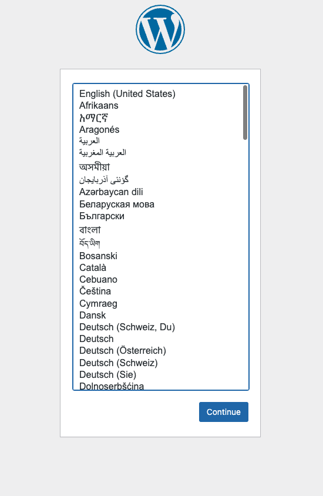

     - Choose your language and continue 
     - You should then see this page: 

     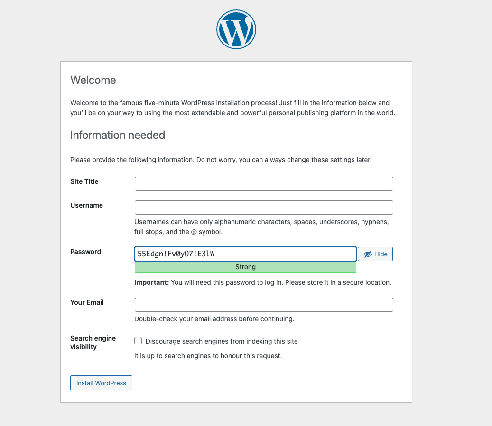

     - Fill in the form and click `Install WordPress`

     - Once WordPress has been installed you should see this login page: 

     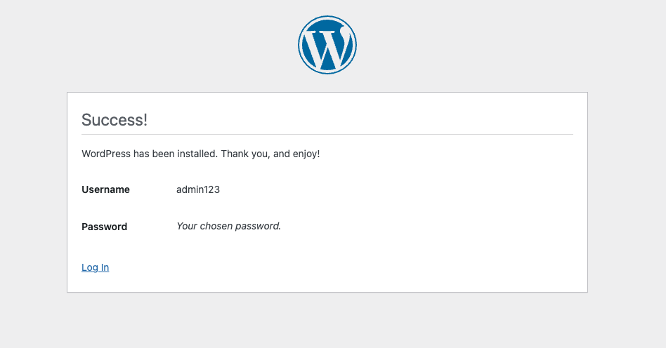
     
     
     - Log in with the credentials set on the last page 
     
     
     - This should log you into your WordPress website: 

     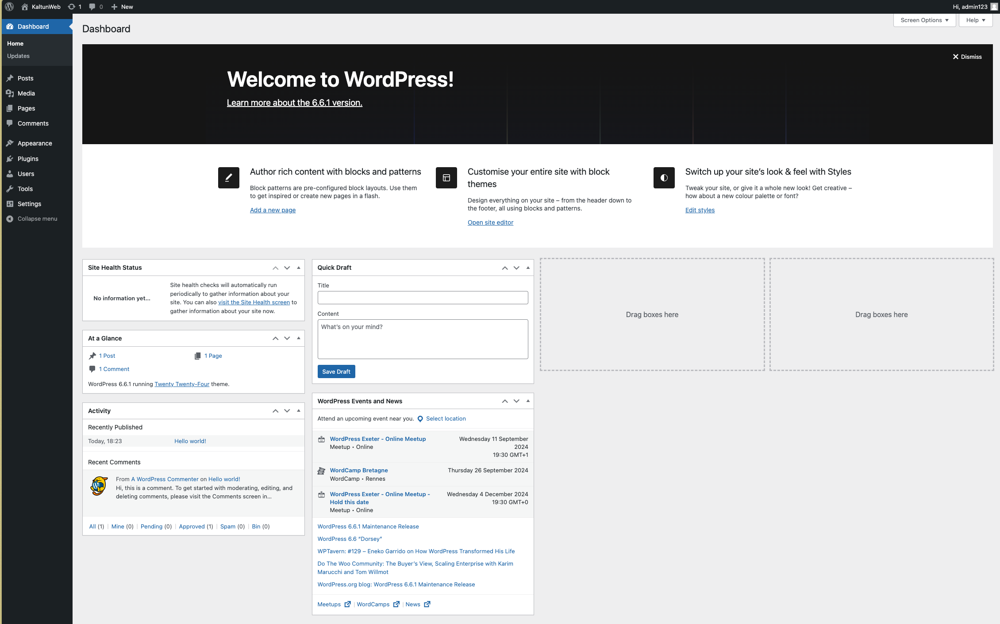
     
     - In the top let corner you should see your website name and an option to `Visit Website`. Click here to see your website!! 

     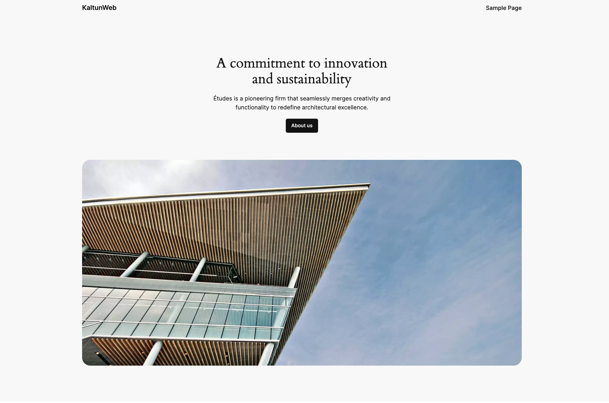
    

### Conclusion

By completing this project, you will have hands-on experience in setting up and managing AWS resources within a VPC, enhancing your skills in cloud infrastructure management.
